<!--
  README for ghl-n8n-ai-calling-agent
  Screenshots in assets/ are pre-rounded PNGs with transparent corners.
  GitHub strips CSS from README files, so the corner radius has to live in the image.
-->


  
  
  
  
  
  
  
  

  

---

An AI agent that calls your GoHighLevel contacts, holds the conversation, books the appointment straight into your calendar, then writes the summary and the tags back to the CRM. It starts at 9 AM and stops when the list is done.

Built in n8n. Twenty-four nodes, six phone numbers, no human in the loop.

 

### Approved and listed by n8n

This workflow is published on the **official n8n template library**, where it sells for **$230**.

**[Replace your call center with an AI agent using GoHighLevel (GHL), Vapi and Twilio](https://n8n.io/workflows/8339-replace-your-call-center-with-an-ai-agent-using-gohighlevel-ghl-vapi-and-twilio/)**

The same system, with the bonus lead importer and the full setup pack, is on [Gumroad](https://tuguidragos.gumroad.com/l/ghl-n8n-vapi-ai-calling-agent).

 

### What a full pipeline looks like

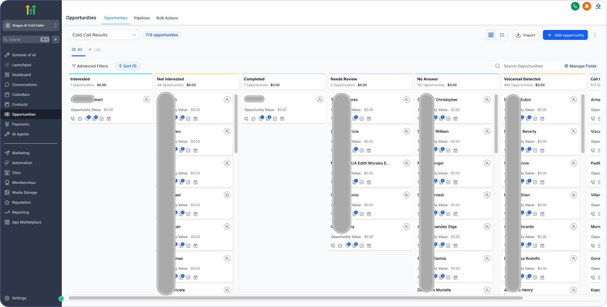

> **On these numbers.** The stages above come from campaigns run against warm, opt-in leads: people who had already filled in a form. Your results depend on the quality, source and temperature of your own list.

 

<strong>What changed in the May 2026 update, full n8n v2 migration</strong>

 

Full migration to n8n v2 with updated APIs, error handling, documentation, and the removal of every complex dependency.

**Added**
- **Zero GHL Developer Apps required.** The dependency on the native n8n GoHighLevel node is gone. The workflow runs purely on standard HTTP Requests with a GHL Private Integration Token (Bearer).
- **Auto-mapping custom fields.** No more hunting for Custom Field IDs. The new `18.5 Get Custom Fields` smart-scan node reads your GHL account and maps the right IDs at runtime.
- **In-canvas tutorials.** Four beginner-friendly sticky-note walkthroughs sitting directly on the workflow canvas. Setup is visual.
- **Error handling with retry** on all 6 HTTP Request nodes: `retryOnFail: true`, `maxTries` 3 to 5, `onError: continueRegularOutput` so a transient API failure cannot kill a run, and `waitBetweenTries` of 2000 to 5000 ms per node.
- **Quick Setup Guide** sticky note listing every field that needs a credential, node by node.

**Changed**
- **GHL Contacts API** migrated from the deprecated `GET /contacts` to `POST /contacts/search` in `GHL Paginated Request` and `GHL Paginated Updated`. Cursor pagination replaced with page-based (`meta.nextPage`); the request body now carries `locationId`, `pageLimit` and `page`.
- **GHL Notes API.** Transcript logging moved to the dedicated `POST /notes` endpoint for cleaner contact profiles.
- **All HTTP Request nodes** from `typeVersion 4.2` to `4.4`/`4.6`.
- **All If nodes** from `typeVersion 2.2` to `2.3`.
- **Schedule Trigger** from `typeVersion 1.2` to `1.3`.

**Fixed**
- **Vapi "Ended" polling.** The call-status loop now handles Vapi's terminal statuses correctly, so it can no longer spin forever.
- **`Check Final Status + shouldContinue`.** The Code node returned a bare `{count, status, shouldContinue}` object, which n8n v2 rejects. Corrected to the item format `[{json: {count, status, shouldContinue}}]`.

**Deprecated**
- `GET /contacts` is no longer used. GoHighLevel deprecated it in favor of `POST /contacts/search` with advanced filters.
- GHL API Keys. GoHighLevel is removing the ability to generate new ones. Migrate to Private Integration Tokens or OAuth 2.0. This workflow already uses Private Integration Tokens.

**Compatibility**

| | |
| :-- | :-- |
| n8n | v2.0+, tested on v2.x, May 2026 |
| GoHighLevel API | v2, Version header `2023-02-21` |
| Vapi API | current stable, `api.vapi.ai` |
| Node.js | v24+, the n8n v2 default |

 

### Who it is for

Call centers, high-volume sales agencies, real estate teams and outreach professionals who need to dial hundreds of contacts a day. It replaces manual top-of-funnel dialing entirely.

> **Legal.** This workflow is provided for educational and workflow-automation purposes. It does not encourage spam calling, robocalling or unsolicited telemarketing. Anyone running it is solely responsible for complying with local, federal and international telephony law, TCPA and GDPR included. Get consent before you call.

 

---

## The engine

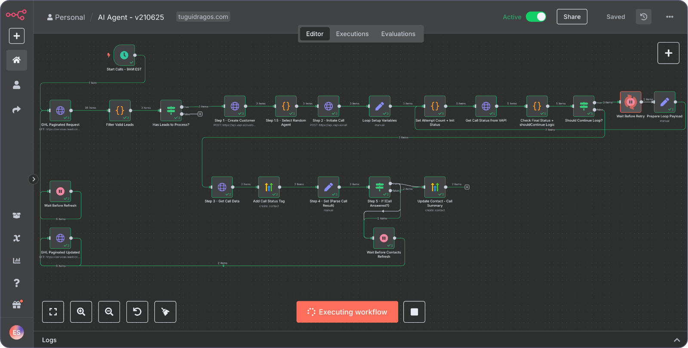

Twenty-four nodes with routing, retry and data processing wired in. Not a chain, a system.

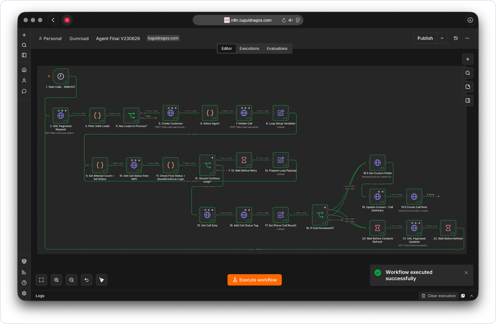

The whole graph, node by node. Contacts come in through `2. GHL Paginated Request`, get filtered, become a Vapi customer, and get a caller ID from `6. Select Agent`. The loop between nodes 9 and 14 polls Vapi until the call reaches a terminal status. From `16. Add Call Status Tag` onward everything goes back into GoHighLevel: the outcome tag, the call summary on the contact record, and the transcript as a note.

 

### Proven under load

- **Endurance.** Tested at over **9 hours in a single execution**, 580+ minutes, no crash, no interruption.
- **Throughput.** One agent makes **~300 calls** in a 9:00 to 19:30 day. Scale by adding agents.

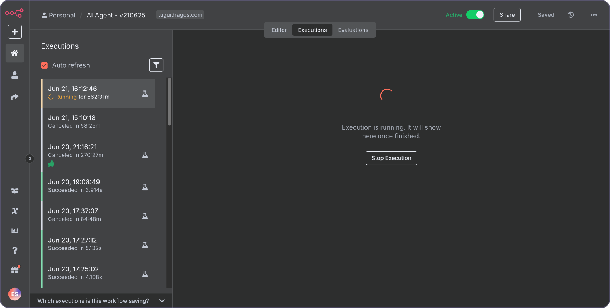

**Caller ID rotation.** The agent spreads calls across a pool of numbers, six in the current setup. This protects number reputation, keeps you out of carrier spam filters and raises the chance the phone actually rings.

**Duplicate prevention.** A GHL tag-locking mechanism guarantees a contact is never called twice, even with thousands of leads moving in parallel.

**Multi-agent ready.** Add agents and numbers without touching the core logic.

 

---

## The brain

The intelligence does not stop when the call does. Every conversation is transcribed, summarized and acted on inside GoHighLevel.

### Call summary and classification

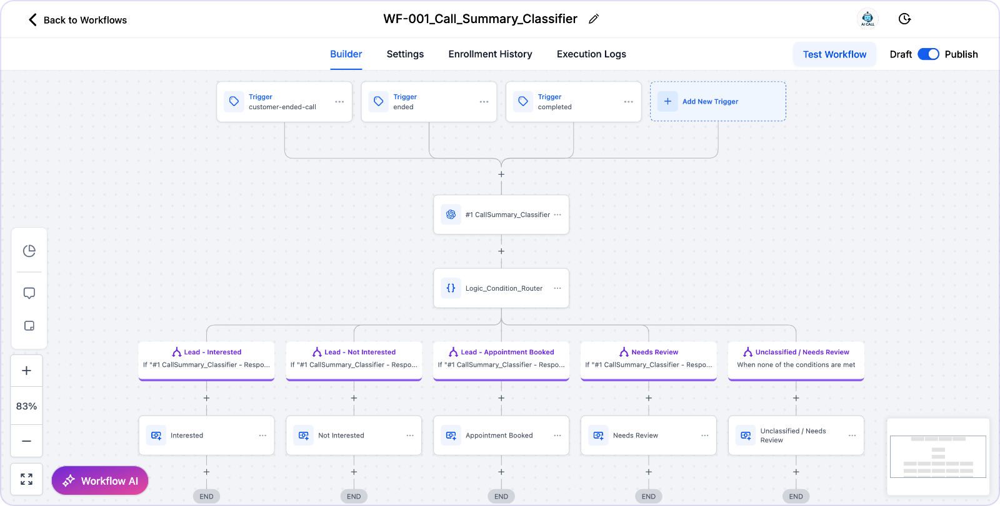

You never listen to a recording. A GHL workflow reads the AI summary and tags the contact `Interested`, `Not Interested`, `Appointment Booked` and the rest.

### Booking straight into the calendar

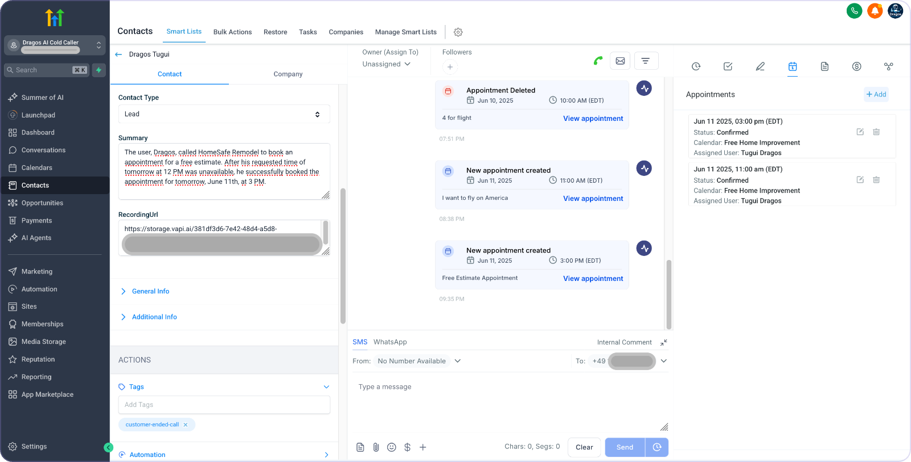

When a lead says yes, the agent hits your GHL calendar over the API, finds a slot and books it. Recording, summary and confirmed appointment all land in the contact's activity feed.

### A suite, not a single workflow

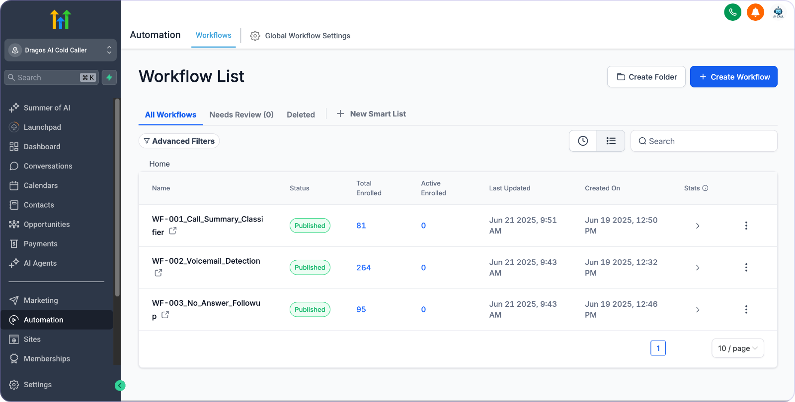

Voicemail detection, post-call analysis, follow-up routing. The package ships several specialized GHL workflows that work together.

### Real-time tagging

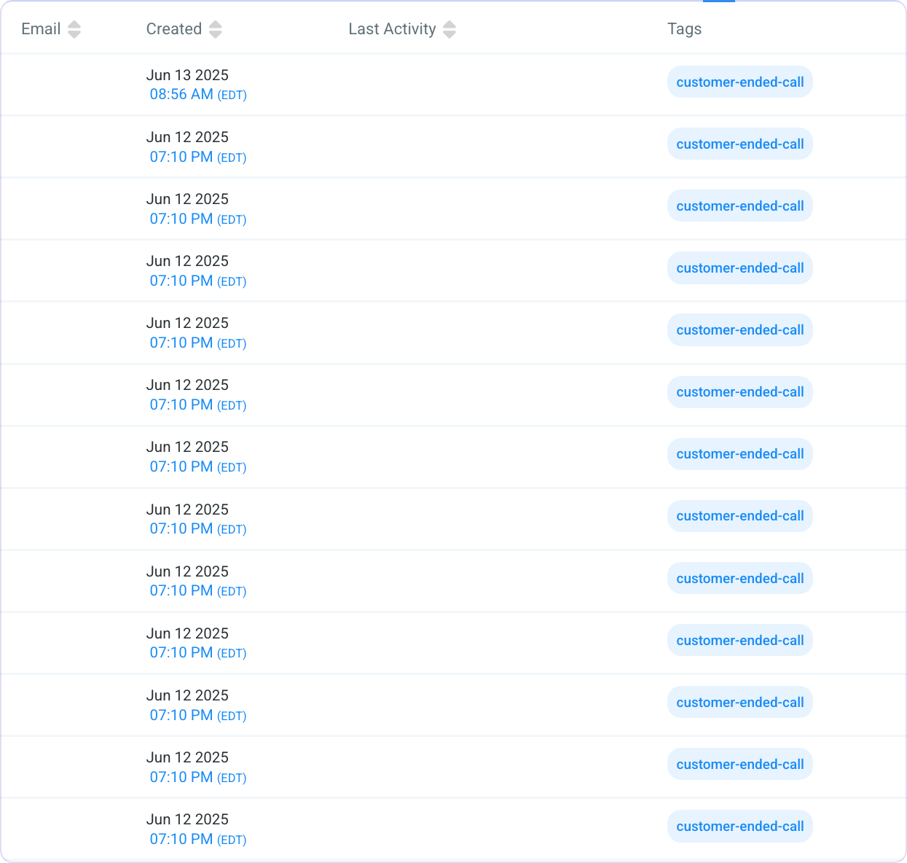

Every call outcome writes a tag the moment it happens, on events like `customer-ended-call` or `busy`. Your CRM stays segmented without anyone touching it.

### Follow-up on SMS and WhatsApp

Because the tag lands instantly, GHL can pick it up and keep going:

- `No Answer` triggers an SMS: *"Hi [Name], this is Daniel from [Company]. I just tried calling about your inquiry. Is there a better time to chat?"*
- `Interested` triggers a WhatsApp message with your brochure or booking link.

 

### The conversation itself

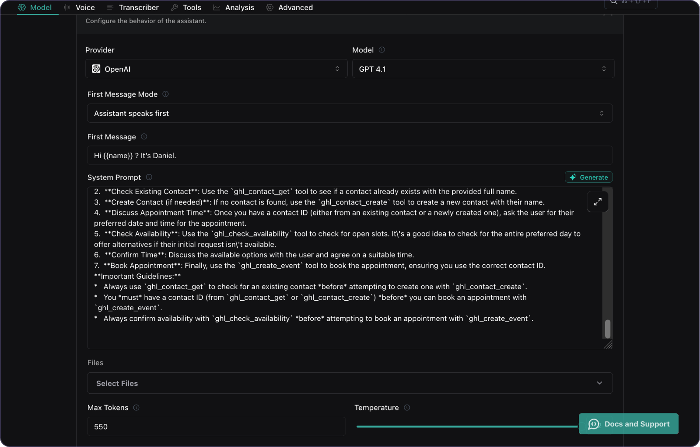

The agent holds a natural conversation, handles objections and talks to your GHL calendar because of a carefully built Vapi prompt: personality, rules, and the tool definitions that let it act mid-call.

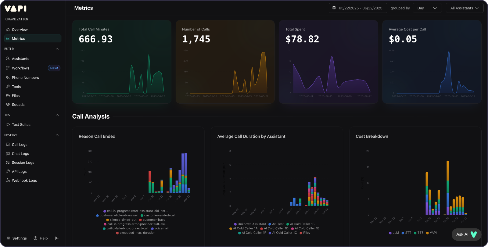

Over **1,700 calls** placed by this system in live campaigns.

 

---

## Setup is on the canvas

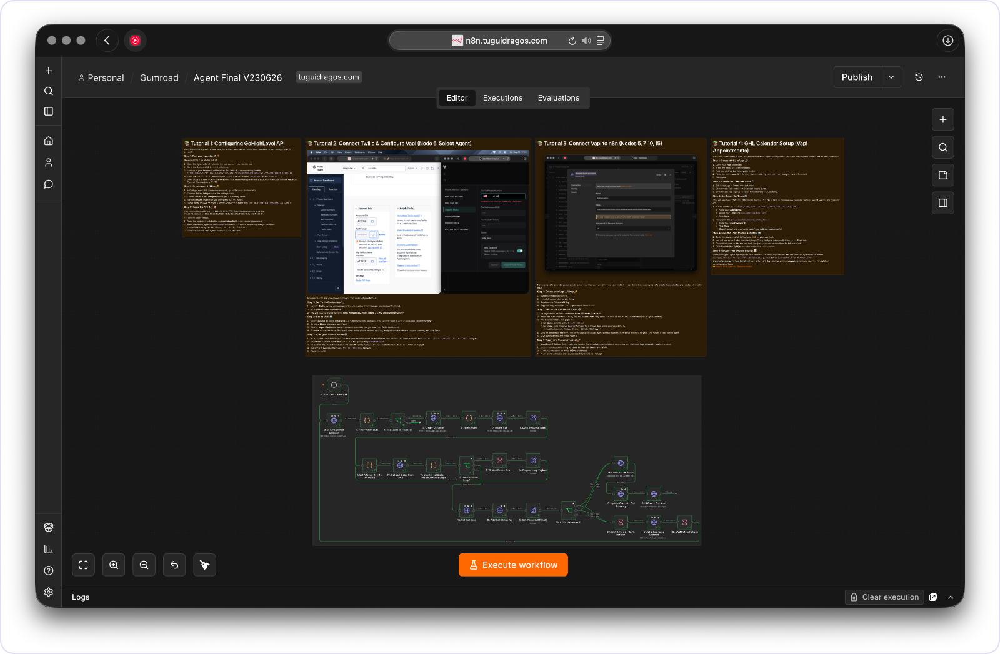

Four tutorials live inside the workflow itself, next to the nodes they configure. Nothing to cross-reference.

**Tutorial 2, Twilio to Vapi.** Import your Twilio number into Vapi and point node 6 at the right assistant.

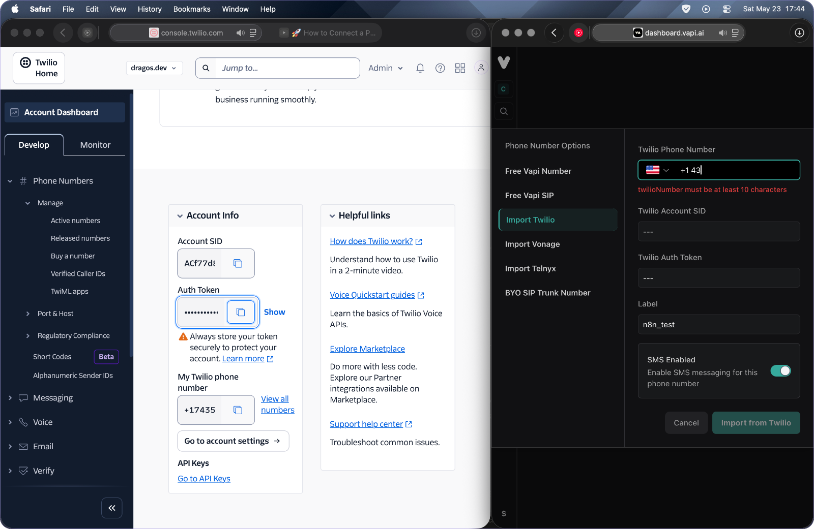

**Tutorial 3, Vapi to n8n.** One Header Auth credential, reused across nodes 5, 7, 10 and 15.

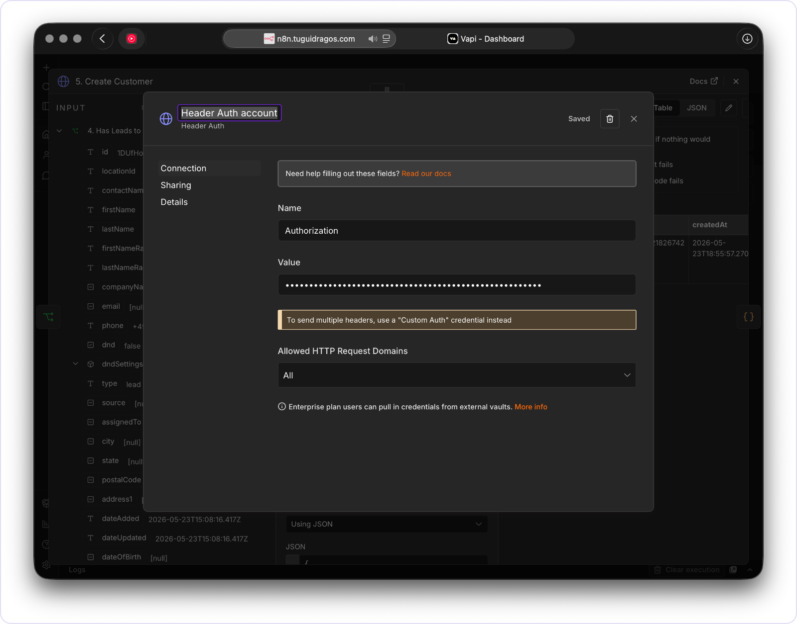

Tutorial 1 covers the GoHighLevel Private Integration Token and your Location ID. Tutorial 4 wires the GHL calendar into Vapi so the agent can check availability and create events during a call.

 

---

## The bonus: leads that refill themselves

An agent with no leads is an agent doing nothing. The package includes a second workflow that syncs **300 to 400 fresh, unprocessed leads** from a Google Sheet into GoHighLevel every night. At 9 AM the calling agent wakes up to a full list.

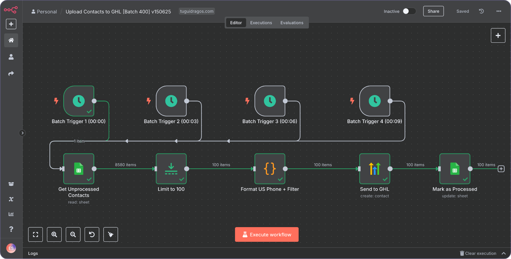

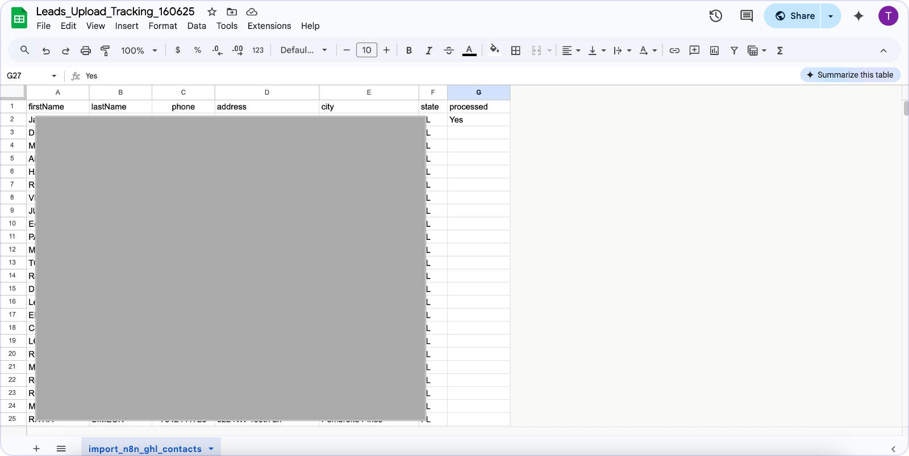

The sheet is plain: `firstName`, `lastName`, `phone`, `address`, `city`, `state`, and a `processed` column the workflow maintains so nothing is imported twice.

**Why this had to be custom.** The stock GoHighLevel node in n8n only fetches the last 100 contacts, which is useless at campaign scale. This talks to the GHL API directly with real pagination, pulling a large fresh batch every day without overloading anything.

 

  

 

---

## Questions

**Why buy it instead of building it?**

Because the hard parts are already solved: bypassing the GHL API contact limit with real pagination, the locking system that stops duplicate calls under parallel load, the Vapi polling loop that handles every terminal status, and a conversational prompt refined over thousands of live calls. Hundreds of hours of building and debugging. You start booking appointments this week, not next quarter.

**What does it cost to run?**

On top of your GHL and n8n subscriptions, a call runs **$0.05 to $0.10** on Vapi and Twilio combined, depending on length.

**Is there a cheaper version?**

Yes, a lite build that runs on Google Sheets instead of GoHighLevel. It calls, qualifies, pulls the email out of the conversation and logs the transcript, but it has no CRM integration, no calendar booking, no tagging and no lead importer. Separate product, **€58.99**.

[Lite build on Gumroad](https://tuguidragos.gumroad.com/l/n8n-ai-call-agent) &nbsp;&#183;&nbsp; [its repo](https://github.com/TuguiDragos/n8n-ai-call-agent) &nbsp;&#183;&nbsp; [walkthrough on YouTube](https://www.youtube.com/watch?v=xgDPP_hJ7ms)

 

---

## License

Proprietary. Buying it gives you the right to run it for your own business, personal or internal. It may not be resold, sublicensed or redistributed, in part or in whole. Full terms in [LICENSE.md](https://github.com/TuguiDragos/ghl-n8n-ai-calling-agent/blob/main/LICENSE.md).

 

---

## About

Built by **Țugui Dragoș** `|QC⟩`. I build automation that runs without supervision: n8n workflows, AI agents, and the quiet machinery behind a business.

  
  
  
  
  

Write to **contact@tuguidragos.com** for questions, custom builds or automation work. If this helped, leave a star.

 

---

Built with 🖤 by <a href="https://tuguidragos.com">Țugui Dragoș</a>

<!-- GoHighLevel AI call agent, GHL n8n workflow, AI phone agent for GoHighLevel, automated appointment booking GHL, n8n Vapi Twilio integration, AI voice agent GoHighLevel, autonomous SDR system, high-volume AI dialer, lead qualification voice AI, GHL API v2 pagination, n8n v2 AI workflow, AI cold calling automation, real estate AI calling agent, call center automation n8n, Vapi GoHighLevel integration, OpenAI smart caller, automated CRM tagging, direct-to-calendar AI booking, no-code AI sales agent, appointment setter AI, GHL voicemail detection, multi-agent calling system, caller ID rotation n8n -->
